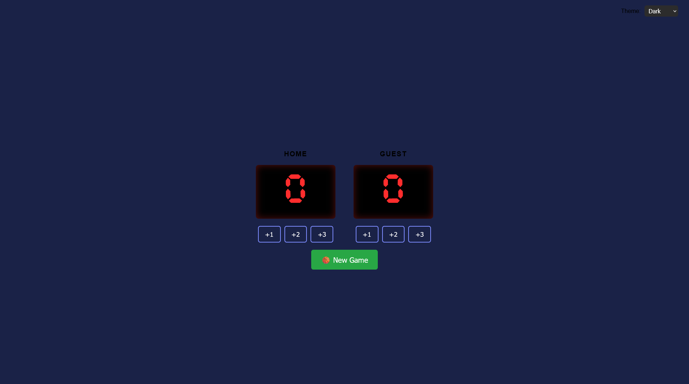
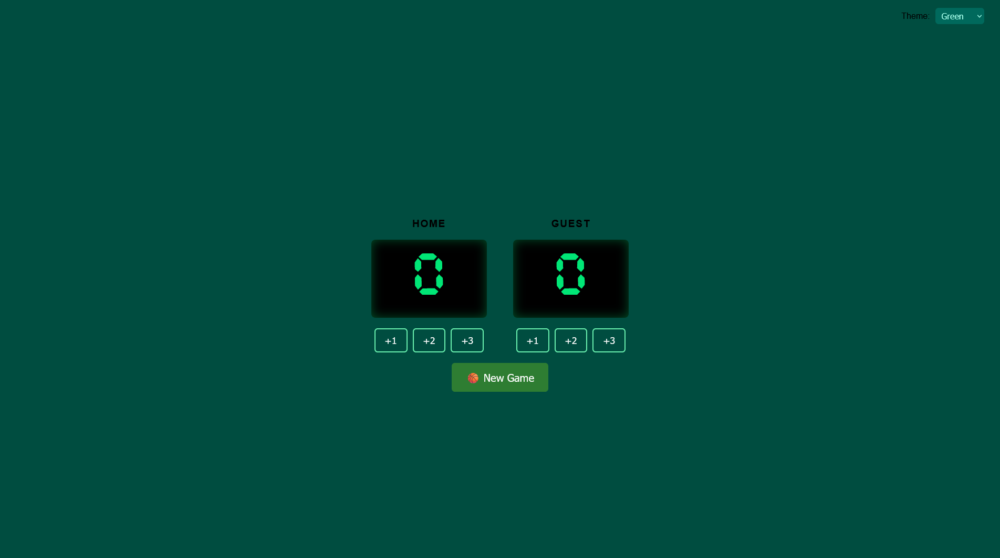
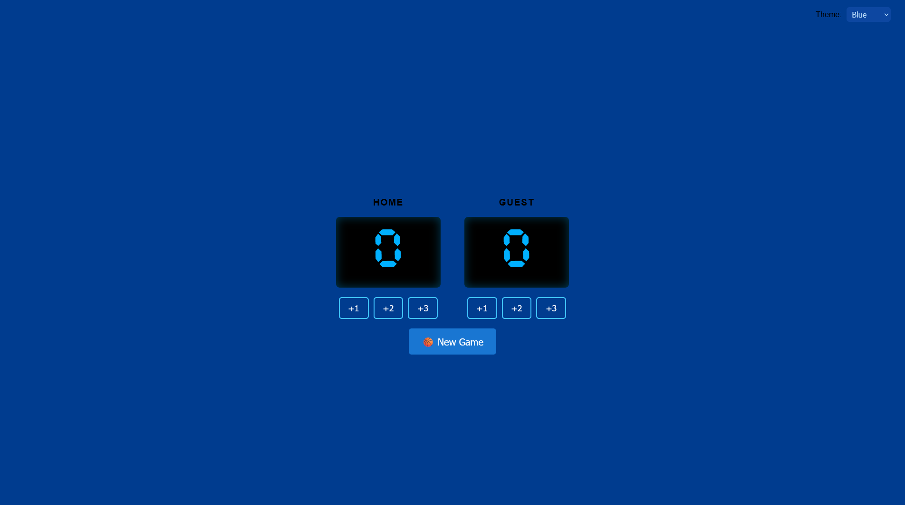
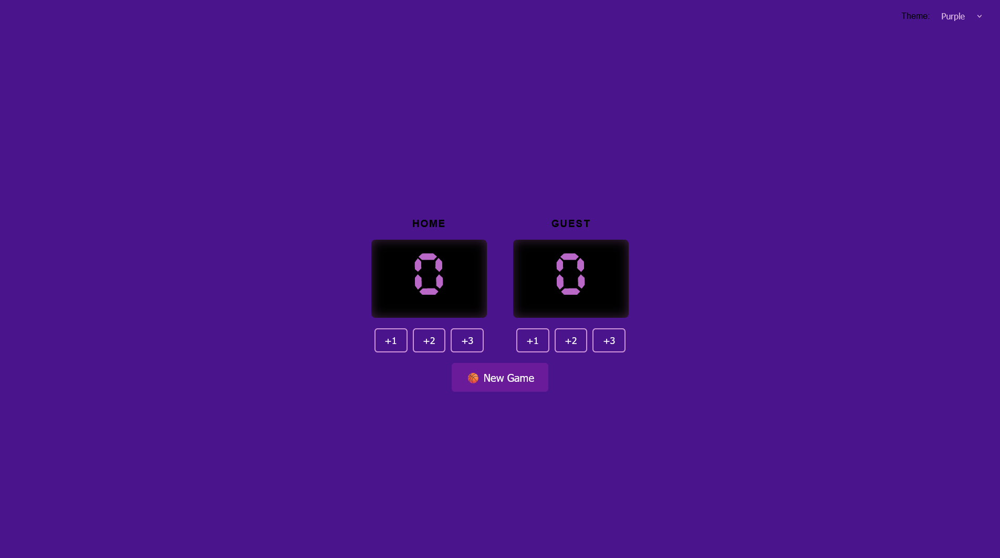
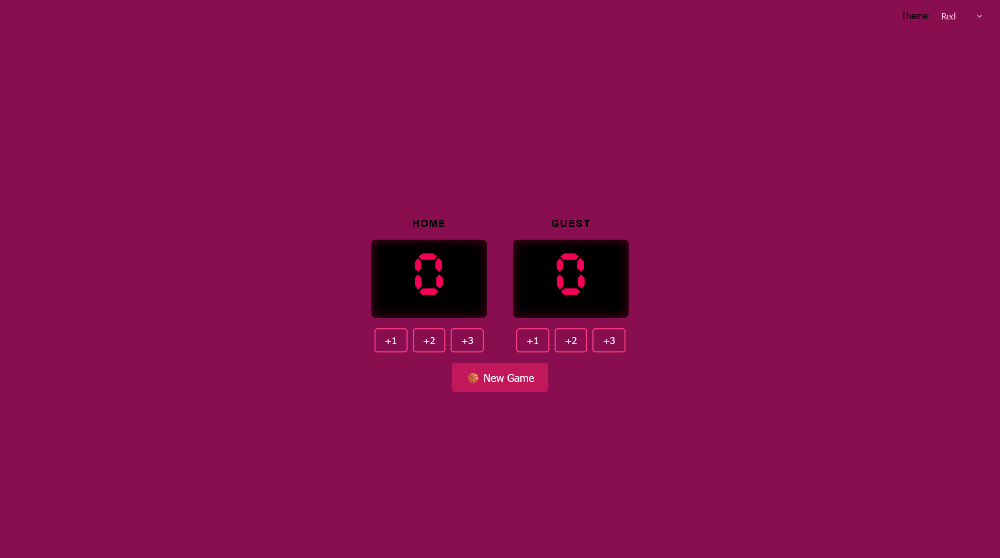
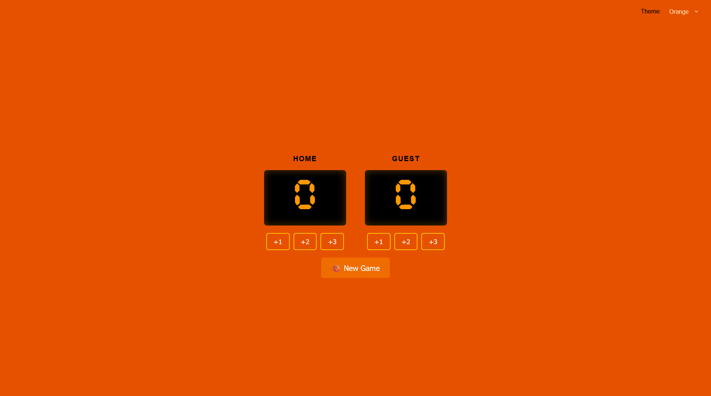

# 🏀 Basketball Scoreboard

[](https://app.netlify.com/projects/basketball-score-scrim/deploys)
[](https://agentphoenix7.github.io/basketball-scoreboard/)
[](https://github.com/AgentPhoenix7/basketball-scoreboard/actions/workflows/deploy.yml)

A simple, interactive basketball scoreboard built with **HTML, CSS, and JavaScript**.  
This project is based on the [Scrimba Frontend Developer Career Path](https://scrimba.com/learn/frontend) solo project.

---

## ✨ Features

- Track scores for **Home** and **Guest** teams  
- Increment by **+1**, **+2**, or **+3** points  
- **Reset/New Game** button to start fresh  
- Highlights the **leading team**  
- Multiple **color themes** (Dark, Green, Blue, Purple, Red, Orange)  
- Retro **digital scoreboard font**  

---

## 🚀 Live Demo

- 🌐 [Live on Netlify](https://basketball-score-scrim.netlify.app/)  
- 🌐 [Live on GitHub Pages](https://agentphoenix7.github.io/basketball-scoreboard/)  

  
*(Default Dark theme — see the full gallery below 👇)*

---

## 🎨 Theme Gallery

<details>
  <summary>Click to view all themes</summary>

**Dark**  


**Green**  


**Blue**  


**Purple**  


**Red**  


**Orange**  


</details>

---

## 📂 Project Structure

```

basketball-scoreboard/
├── index.html      # main UI
├── index.css       # styling & themes
├── index.js        # scoreboard logic
├── fonts/          # Cursed Timer font
├── README.md
└── LICENSE

```

---

## 🛠️ How to Run Locally

1. Clone the repo:
   ```bash
   git clone https://github.com/AgentPhoenix7/basketball-scoreboard.git
   cd basketball-scoreboard
   ```

2. Open `index.html` directly in your browser
   **or** serve with a local server:

   ```bash
   # Python 3
   python -m http.server 5500

   # Node.js (if you have npx)
   npx serve
   ```

   Then visit: [http://localhost:5500](http://localhost:5500)

---

## 📦 Deployment

This project is continuously deployed to both **Netlify** and **GitHub Pages**:

* [](https://app.netlify.com/projects/basketball-score-scrim/deploys)
  👉 [Live on Netlify](https://basketball-score-scrim.netlify.app/)

* [](https://agentphoenix7.github.io/basketball-scoreboard/)
  [](https://github.com/AgentPhoenix7/basketball-scoreboard/actions/workflows/deploy.yml)
  👉 [Live on GitHub Pages](https://agentphoenix7.github.io/basketball-scoreboard/)

Both pipelines automatically rebuild and redeploy whenever changes are pushed to the `main` branch.

---

## 📱 Mobile & Accessibility

* Responsive design with flexible layout
* Keyboard accessible buttons
* High contrast themes for visibility

---

## 📜 License

This project is licensed under the [MIT License](LICENSE).

---

